# Marvi — Architecture

Low-level architecture for engineers and AI agents. **Read this before implementing a feature or
changing existing behavior**, and update it in the same change when structure or behavior moves.
Why the product exists: [goal.md](goal.md). What is planned and what is done: [project.md](project.md).

Contents: 1 Rules for agents · 2 System context · 3 Repository map · 4 Backend · 5 Data model ·
6 Authentication · 7 Key flows · 8 Frontend · 9 Deployment · 10 Conventions · 11 Gotchas · 12 How to add or remove a feature

## 1. Rules for agents (read first)

1. **Features are vertical slices.** A feature is the same folder name in the API (`Features/<X>`),
   the domain (`<X>`), and tests (`test/Marvi.Tests/<X>`), plus a portal/feature folder in the SPA.
   Put new code in the feature it belongs to; create a new feature rather than growing an unrelated one.
2. **Dependency direction:** `Api → Domain` and `Api → Infrastructure → Domain`. The domain has no
   ASP.NET, EF Core or HTTP dependency. Never reference `Api` from `Domain`/`Infrastructure`.
3. **Business rules live in `Marvi.Domain/<Feature>/*Service.cs`** as pure, stateless classes that
   operate on already-loaded entities. Controllers load data through `AppDbContext`, call the service,
   and save. There is no repository layer (deliberate; see §11).
4. **Authorization is server-side only.** Every controller carries `[Authorize(Roles=…)]` (or
   `[AllowAnonymous]`) and enforces ownership (`client_id` claim) in code. Angular guards are UX.
5. **Never accept a price from the client.** The SPA sends product ids and quantities; prices come
   from `PricingService` (and employee final prices on quotes).
6. **Admin mutations are audited** through the injected `AuditLogger`.
7. **Schema changes need an EF migration** in `Marvi.Infrastructure/Migrations`.
8. After a change run `dotnet test Marvi.slnx` and (client) `npx tsc -p tsconfig.app.json --noEmit`
   or `npm run build` (needs Node >= 22.22.3).

## 2. System context

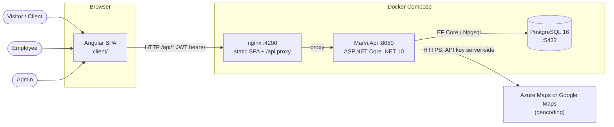

## 3. Repository map

```
Marvi.slnx
global.json                   .NET SDK 10.0.100 (rollForward latestMinor)
goal.md · project.md · architecture.md · README.md
docs/archive/                 superseded plan documents (history only; do not treat as spec)
src/
  Marvi.Api/                  HTTP host
    Program.cs                composition root only
    Features/<Feature>/       *Controller.cs, Contracts/ (one record per file), <Feature>Module.cs
  Marvi.Domain/<Feature>/     entities, enums, pure business services
  Marvi.Infrastructure/
    Data/                     AppDbContext, ApplicationUser
    Geocoding/                IGeocodingProvider + Azure/Google implementations
    DependencyInjection/      AddInfrastructure(...)
    Migrations/               EF Core migrations
  Marvi.Shared/               empty placeholder (candidate for removal)
test/Marvi.Tests/<Feature>/   unit + integration tests; Support/ holds MarviApiFactory, fakes
client/src/app/               core/ · shared/ · features/<feature>/
deploy/                       Dockerfile.api, Dockerfile.client, nginx.conf, docker-compose.yml
```

## 4. Backend

### 4.1 Layers and project references

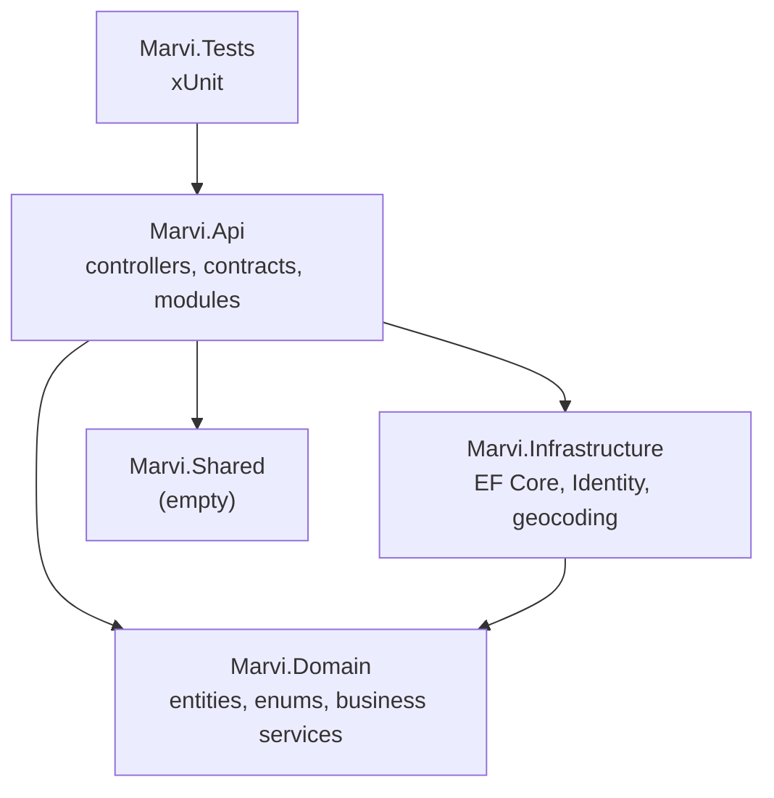

### 4.2 Feature map

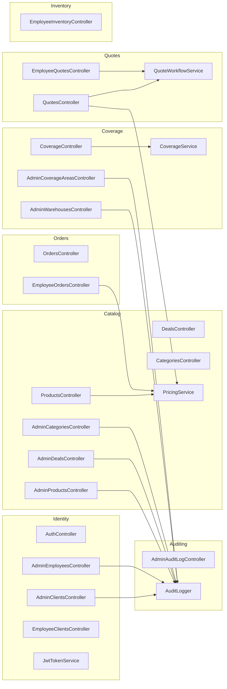

Cross-feature coupling that exists today (keep it minimal): Orders and Quotes call `PricingService`;
`QuoteWorkflowService.AcceptQuote` creates an `Order`; admin controllers in Identity/Catalog/Coverage
use `AuditLogger`; all features share `AppDbContext`.

### 4.3 Composition (`Program.cs`)

1. `AddControllers`, `AddOpenApi`, `AddInfrastructure(config)`.
2. One call per feature module: `AddIdentityFeature(config)` (JWT bearer validation, authorization,
   `JwtTokenService`, role seeding helper), `AddCatalogFeature` (`PricingService`),
   `AddCoverageFeature` (`CoverageService`), `AddQuotesFeature` (`QuoteWorkflowService`),
   `AddAuditingFeature` (`AuditLogger`, `IHttpContextAccessor`). Controllers are discovered by
   convention, so they need no registration.
3. CORS policy `SpaClient` (origin `Cors:AllowedOrigin`, default `http://localhost:4200`).
4. Pipeline: HTTPS redirection → CORS → authentication → authorization → controllers.
5. Outside the `Testing` environment on startup: apply migrations, `IdentityModule.SeedRolesAsync` (creates `Client`,
   `Employee`, `Admin`), `IdentityModule.SeedAdminAsync` (first admin from config), and
   `DefaultPricingTier.GetOrCreateAsync` (ensures one default tier, "Standard"). Tests run the same seeding via `MarviApiFactory`.

`AddInfrastructure` registers `AppDbContext` (Npgsql, snake_case naming), ASP.NET Core Identity
(`ApplicationUser`, `IdentityRole<Guid>`), a singleton `HttpClient`, and the `IGeocodingProvider`
chosen by `Geocoding:Provider` (`Google`, otherwise Azure Maps).

### 4.4 Business services (domain)

| Service | Responsibility |
|---|---|
| `PricingService.ResolvePrice(product, tier, pricingRows, activeDeals, qty)` | Tier unit price by quantity break (rows unique per product + tier + `MinQty`), then best active deal → `PricingResult`; throws `InvalidOperationException` when the tier has no price for the product |
| `CoverageService.CheckCoverage(lat, lng, areas)` | Radius check by haversine distance; `Polygon` throws `NotSupportedException` |
| `QuoteWorkflowService` | `CreateQuote`, `PriceQuote` (Submitted → Priced; every line needs a non-negative final price; employee id nullable for admins), `AcceptQuote` (Priced → Accepted, returns the new `Order`); invalid transitions throw `InvalidOperationException` |

### 4.5 State machines

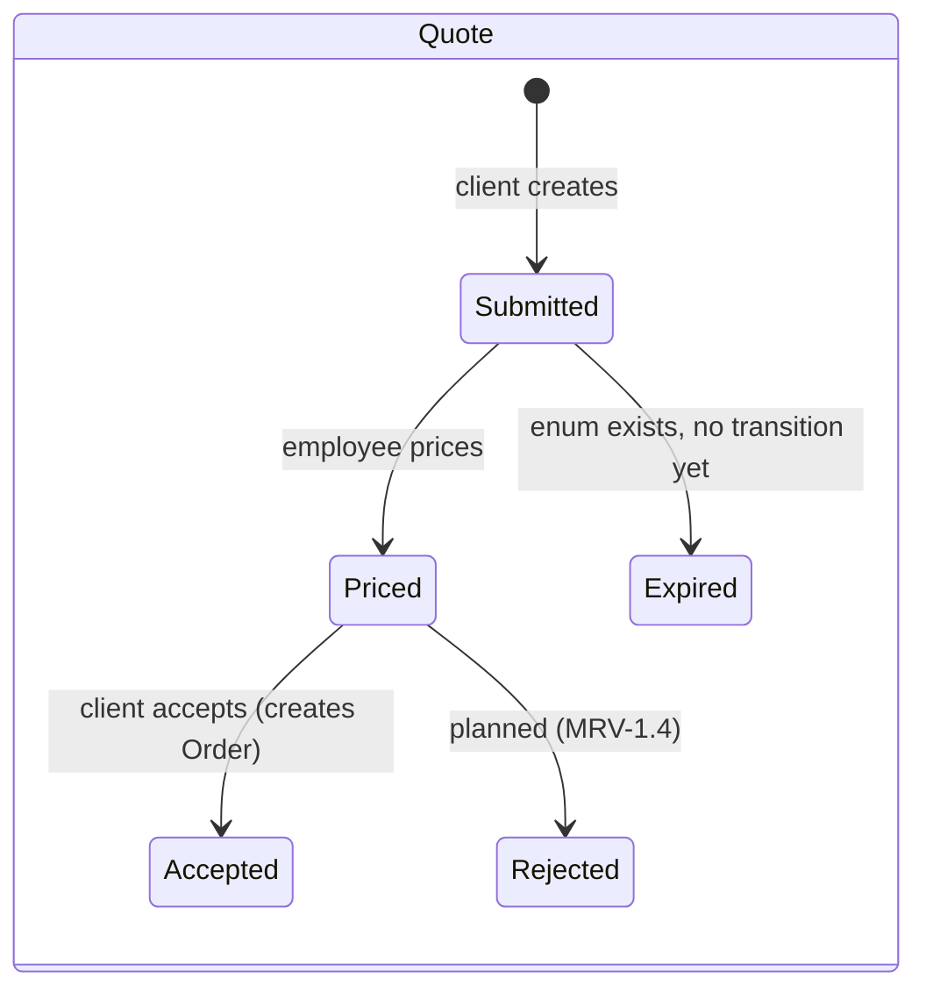

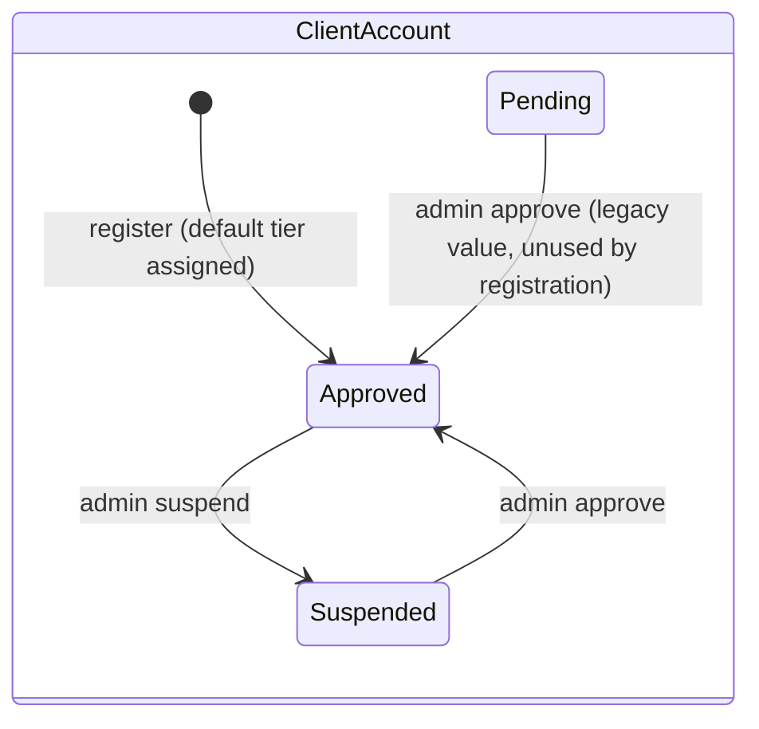

`OrderStatus` values: `Placed`, `Backordered`, `Fulfilled`, `Cancelled`. `QuoteStatus` also has `Draft`
(unused by current flows). Orders are created as `Placed`.

## 5. Data model

Tables are snake_case plurals via `UseSnakeCaseNamingConvention()`. `Product.Attributes`,
`AuditLogEntry.Details` (string dictionaries) and `CoverageArea.PolygonGeoJson` use `jsonb`.

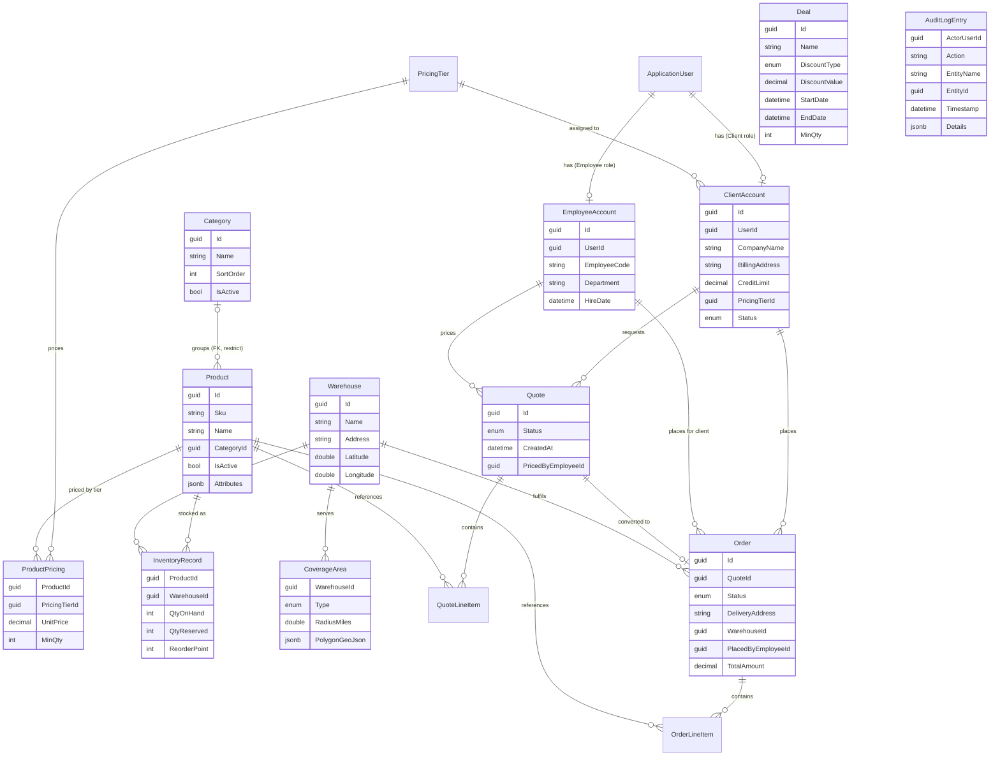

`Product.CategoryId` is a real foreign key to `Category` (restrict delete; nullable). Not drawn as
relationships because they are plain id lists: `Deal.ProductIds` and `Deal.CategoryIds` (no foreign key, so
`AdminCategoriesController` checks deals itself before deleting). `ClientAccount.ShippingAddresses`
is a string list column. `AuditLogEntry.ActorUserId` is not a foreign key.

## 6. Authentication and authorization

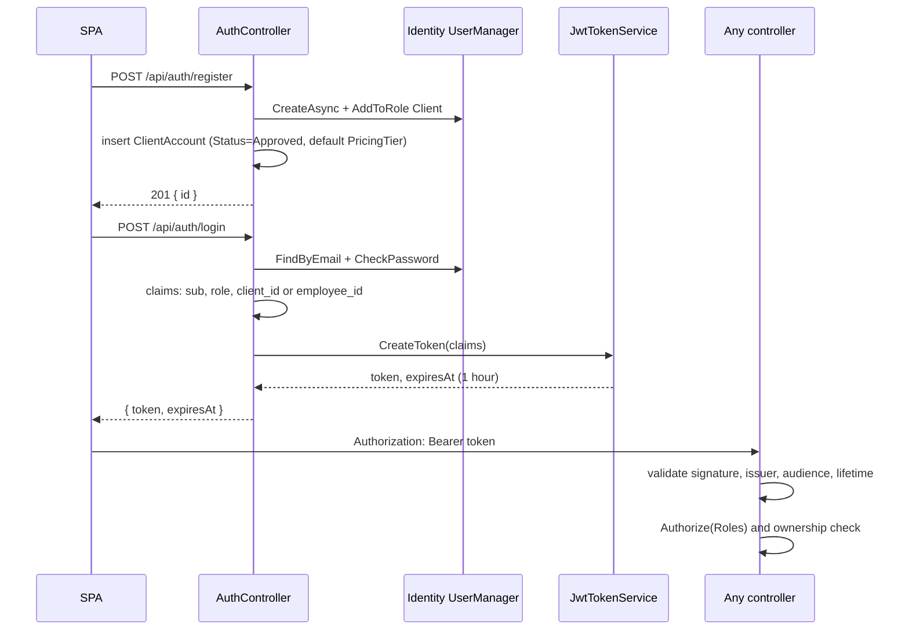

- Roles: `Client`, `Employee`, `Admin`. Only `POST /api/admin/employees` creates an Employee user.
- Claims: `sub` (user id), role, and `client_id` or `employee_id`.
- The role claim key is the long URI `http://schemas.microsoft.com/ws/2008/06/identity/claims/role`
  (`ClaimTypes.Role` on .NET 10; older frameworks used `xmlsoap.org/2005/...`), not `"role"`. The SPA's `AuthService` decodes it; any new JWT consumer must too.
  The SPA once used the old URI, so `role()` was always null and every portal bounced the user home; `auth.service.spec.ts` now pins a payload copied from a real login.
- Settings: `Jwt:Key`, `Jwt:Issuer` (`Marvi.Api`), `Jwt:Audience` (`Marvi.Client`). No refresh tokens.
- `ClientAccountStatus`: registration yields `Approved`. `Suspended` clients cannot create or accept quotes (`QuotesController`); employee orders require `Approved`.
- **Admins have no employee account**, so no `employee_id` claim. Employee-area endpoints accept Admin and record a null employee (`Quote.PricedByEmployeeId`, `Order.PlacedByEmployeeId`).
- **First admin:** created at startup from `Seed:AdminEmail` / `Seed:AdminPassword` (dev values in `appsettings.Development.json` and `deploy/docker-compose.yml`; set your own elsewhere). Without them no Admin exists.

## 7. Key flows

### 7.1 Catalog pricing

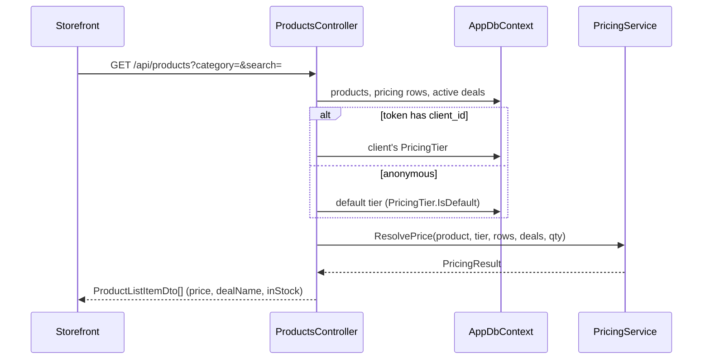

### 7.2 Coverage check

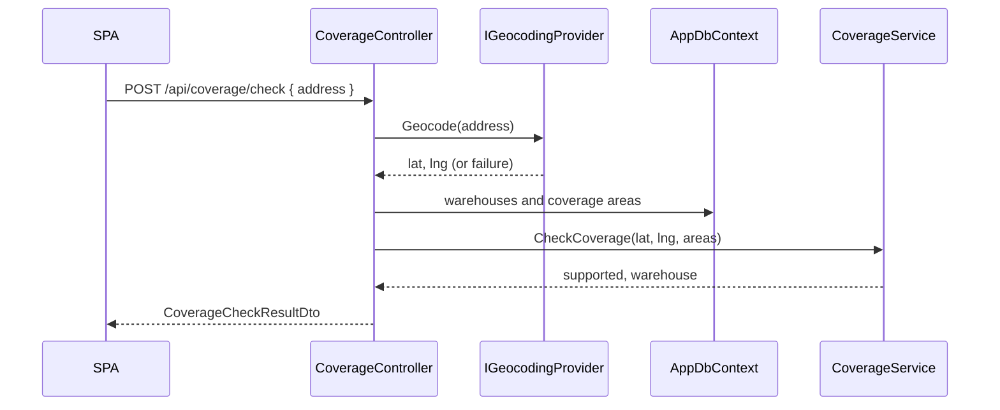

### 7.3 Quote to order

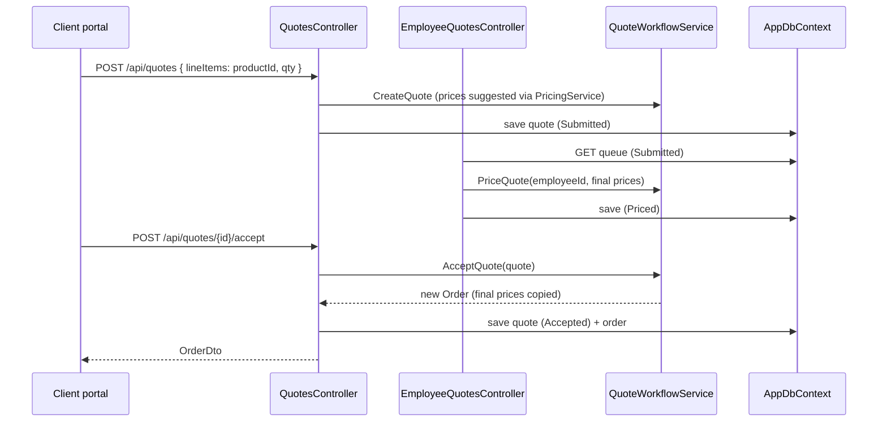

### 7.4 Employee order and admin audit

`EmployeeOrdersController.Create` loads the client, requires `Approved`, prices each line with
`PricingService` using that client's tier, and saves an `Order` with `PlacedByEmployeeId`.
Admin controllers save the change, then call `AuditLogger.LogAsync(action, entityName, entityId, details)`,
which writes an `AuditLogEntry` with the actor taken from the JWT `sub` claim.

## 8. Frontend (`client/`)

Angular (standalone components, signals, functional guards/interceptors), SCSS, Vitest.
Angular project name: `marvi-client`; build output `dist/marvi-client/browser`.

```
src/app/
  app.ts · app.html (<router-outlet />) · app.config.ts · app.routes.ts
  core/auth/                AuthService, jwt.interceptor.ts, role.guard.ts
  shared/models/            types used by more than one feature (quote.model.ts, order.model.ts)
  features/
    home/                   placeholder awaiting the owner's design
    auth/login/             login page
    storefront/             public catalog, deals, coverage checker  + api/ (products, deals, coverage)
    client-portal/          quotes and orders for clients           + api/ (quotes, orders)
    employee-portal/        quote queue, order taking, lookups      + api/ (employee)
    admin-portal/           people, catalog, coverage, audit        + api/ (admin)
```

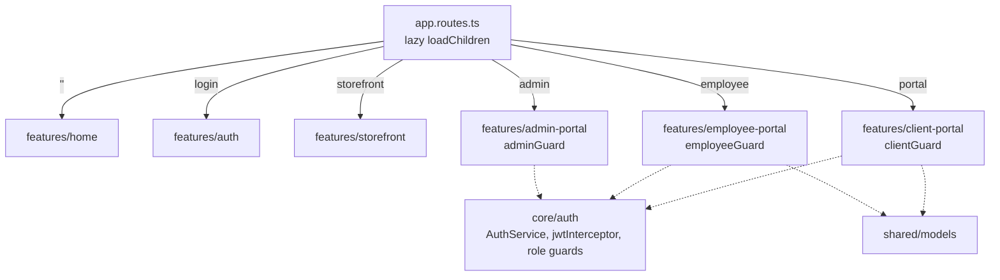

- Each feature owns a `<feature>.routes.ts`, its components and an `api/` folder of `HttpClient`
  services (relative URLs under `/api`). Cross-feature types go in `shared/models`.
- `jwtInterceptor` adds the bearer token and handles 401. Guards are `clientGuard`, `employeeGuard`
  (Employee or Admin) and `adminGuard`; the token is stored in `localStorage` as `marvi_auth_token`.
- Build with `npm run build`. Do not pass a ternary between `{key: v}` and `{}` as `HttpClient`
  `params` (wrong overload); build a `Record<string, string>` and assign conditionally (see
  `products.service.ts`).
- **Design system (MRV-2.3a):** tokens, element defaults and primitive classes (`.container .page .btn .card .field .alert .eyebrow`) live
  in `src/styles/_tokens.scss`, `_base.scss`, `_components.scss`, loaded by `src/styles.scss`. Colors are CSS custom properties; change them only in `_tokens.scss`.
  Shared components are in `shared/ui` (`app-header`, `app-footer`), composed by the shell in `app.html` (skip link, header, `<main id="content">`, footer).
  The landing page and the React hero island (MRV-2.3c/d) are still planned (`project.md` §10).
- **Session state:** `AuthService.isAuthenticated()` is a plain function (not a `computed`, which would never notice expiry) meaning an unexpired token that carries a known role; a stale or role-less token in storage is dropped at startup. The role guards require it, and `guestGuard` keeps signed-in users off `/login` and `/register` (registering again would silently replace their session).
  The skip link focuses `<main>` in code (a bare `#content` href would resolve against `<base href="/">` and leave the page).
- **Copy:** all user-facing text is in `core/i18n/pt-br.ts` (pt-BR only); templates read from `PT`, never hard-code strings. The API's English Identity errors are mapped to pt-BR in `core/i18n/identity-errors.ts`; unknown messages fall back to a generic one, so English never reaches the user.
- **Zoneless:** there is no `zone.js`. State that changes inside an async callback (HTTP, timers) **must be a signal**; assigning a plain field
  there does not re-render. Plain fields are fine only for `ngModel` bindings that are never written from a callback; form fields that are reset after an HTTP call are signals (`[(ngModel)]` binds to a writable signal). The storefront and the three portals were converted to signals on 2026-10-02 (they
  had never rendered API data); keep new screens on signals.
- **Client tests:** vitest via `ng test`, specs beside the code; `core/auth/testing/fake-token.ts` builds a JWT for role-dependent tests. With Node < 22.22.3 run
  them in Docker (README).

## 9. Deployment

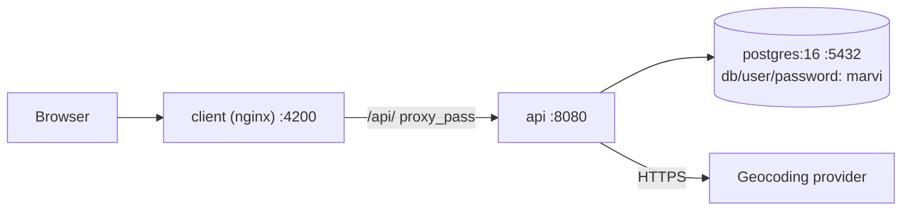

- `docker-compose.yml` builds `postgres`, `api` (`Dockerfile.api`: SDK build → ASP.NET runtime) and
  `client` (`Dockerfile.client`: Node build → nginx, config from `nginx.conf`).
- In compose the browser sees one origin, so CORS matters only for `ng serve` at :4200 against :5083.
- Secrets (`POSTGRES_PASSWORD`, `JWT_KEY`, `SEED_ADMIN_*`) come from untracked `deploy/.env`; copy `deploy/.env.example`. Compose fails fast if one is missing.
- To run the API from the IDE against the compose database, layer `deploy/docker-compose.dev-db.yml` (publishes Postgres on 127.0.0.1 only); see README.
- The Postgres password reaches the API as `PGPASSWORD`, not inside the connection string, so `;`, `=` or quotes in it are safe.
- Only the SPA (:4200) and API (:8080) are published; Postgres is reachable only inside the compose network. The API runs as the non-root `app` user and exposes `GET /health`; the `client` waits for it to be healthy.
- `.dockerignore` (root, for the API image) and `client/.dockerignore` keep host `bin/obj` and `node_modules` out of build contexts.
- Migrations run automatically at API startup. The compose stack is verified end to end (MRV-3.1). Configuration (`Jwt:Key`, geocoding key, DB credentials) must be overridden for production.

## 10. Conventions

- **API contracts:** one `record` per file in `Features/<X>/Contracts`; `*Request` for inputs,
  `*Dto` for outputs (exception: `AuthResponse`). Namespace equals folder path.
- **Controllers:** `[ApiController]`, route `api/<area>/…`, constructor-injected `AppDbContext`
  and services. Admin routes live under `api/admin`, employee routes under `api/employee`.
- **Modules:** a feature that needs DI registrations exposes `Add<X>Feature(this IServiceCollection)`
  in `<X>Module.cs` and is called from `Program.cs`.
- **Domain:** C# `class` entities with public setters (EF Core), enums stored as defined; services
  are pure and unit-tested in `test/Marvi.Tests/<Feature>`.
- **Tests:** integration tests use `MarviApiFactory` (EF InMemory + `FakeGeocodingProvider`,
  environment `Testing`, which skips migration/seed; the factory seeds roles itself).
- **Frontend:** standalone components, one `*.routes.ts` per feature, no business/price logic.
- **Formatting:** `.editorconfig` and Prettier in `client/`.

## 11. Gotchas and deliberate decisions

- **No repository layer.** `AppDbContext` is used directly by controllers; domain services stay pure.
- **`Marvi.Api` shows `Microsoft.EntityFrameworkCore.Design` but gets EF Core APIs
  transitively** from `Marvi.Infrastructure`; do not remove that reference chain.
- **Polygon coverage is unimplemented** and throws; only `Radius` works.
- **Geocoding providers are untested against live keys.**
- **Orders do not touch inventory:** no reservation, decrement or stock check yet (Release 2); `Order.WarehouseId` and
  quote-to-order delivery address are not populated by the quote flow.
- **`Quote.Draft`/`Expired` and `Order.Backordered/Fulfilled/Cancelled`** exist as enum values with
  no workflow yet.
- **`Marvi.Shared` and `Marvi.Infrastructure/Class1.cs`** are empty template leftovers.
- **Enums go over the API as names** (`"Priced"`, `"Approved"`), via `[JsonConverter(typeof(JsonStringEnumConverter))]` on each exposed enum in the domain; the SPA models are string unions and the database still stores integers. A new exposed enum needs the attribute (`EnumContractTests`).
- **Known limitation:** deleting a category and creating a deal that targets it at the same instant can leave the deal with a dangling id (no foreign key on a list; the check is not atomic). Accepted for the admin-only volume; a join table would remove it.
- **Category names are capped at 200 characters** by the controller (keeps them under the btree index row limit).
- **Constraint races return 409, other database errors do not:** `DbUpdateException.IsConstraintViolation()` (Infrastructure) is true only for Postgres unique (23505) and foreign-key (23503) violations; controllers that pre-check and then save use it so a timeout is never reported as a duplicate.
- **A deal's `CategoryIds` are validated by `AdminDealsController`** (no foreign key on a list); products rely on the real foreign key plus a controller check.
- **Categories are deactivated, not deleted, once in use:** `DELETE /api/admin/categories/{id}` returns 409 while a product or deal references it. Category names are unique ignoring case: checked in the controller, and enforced by the hand-written expression index `ix_categories_name_lower` on `lower(name)` (migration `CaseInsensitiveCategoryNames`; EF cannot model it, so it is absent from the model and a duplicate race surfaces as 409 via `DbUpdateException`).
- **Default tier:** exactly one `PricingTier.IsDefault` (unique filtered index). Anonymous visitors and new clients use it; pre-flag data is self-healed by promoting the alphabetically first tier on startup/registration.
- **Missing price is not free:** quotes leave `SuggestedUnitPrice` null for unpriced products (the employee must set it); employee orders reject them with 400.
- **There is no rate limiting** on any endpoint (planned in MRV-3.3).

## 12. How to add or remove a feature

**Add `Foo`:**
1. `src/Marvi.Domain/Foo/` — entities, enums, services; add `DbSet`s and mappings in `AppDbContext`; add a migration.
2. `src/Marvi.Api/Features/Foo/` — controllers, `Contracts/`, and `FooModule.cs` with `AddFooFeature`; call it in `Program.cs`.
3. `test/Marvi.Tests/Foo/` — service tests and integration tests via `MarviApiFactory`.
4. `client/src/app/features/foo/` — `foo.routes.ts`, components, `api/` services; add a lazy route in `app.routes.ts`; guard it if role-restricted.
5. Update this file (feature map, data model, flows) and `project.md` (status, API table).

**Remove `Foo`:** delete the four folders above, the `AddFooFeature` line and the lazy route, remove its
`DbSet`s and add a migration dropping its tables, then fix any cross-feature references listed in §4.2.
