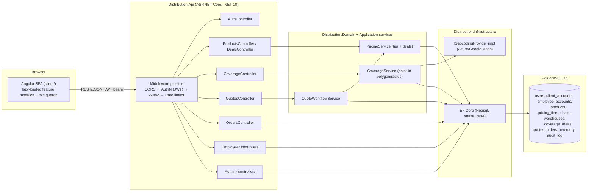
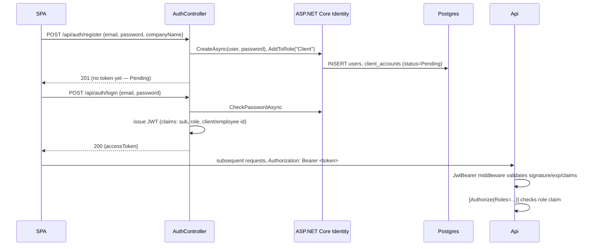
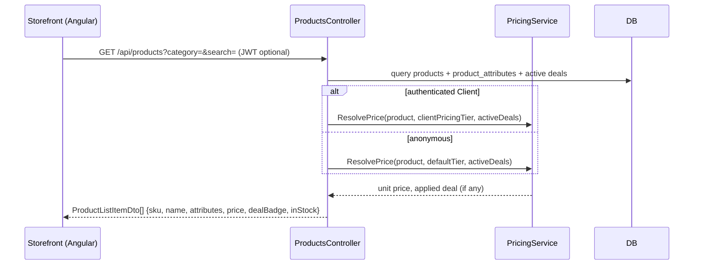
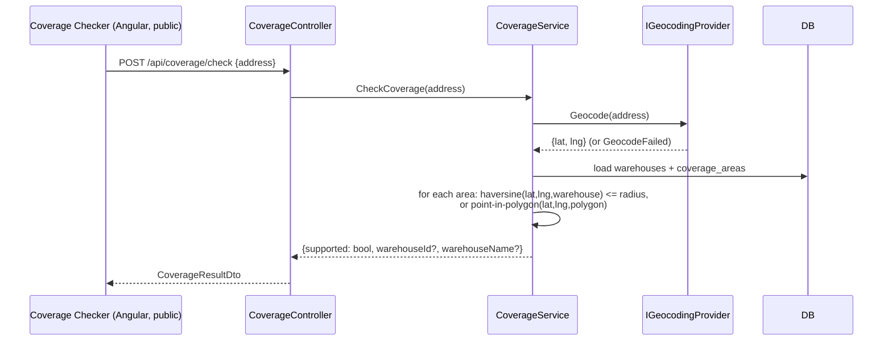
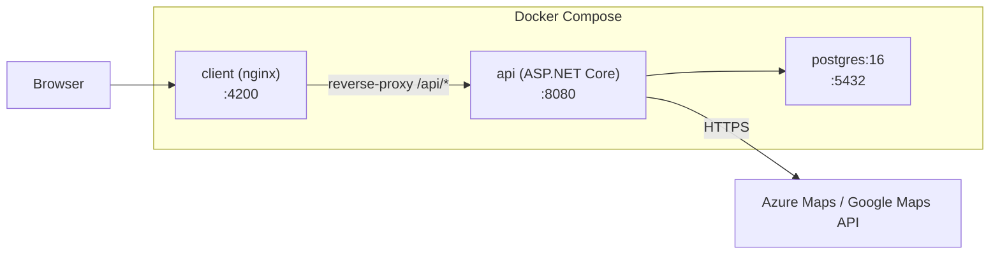

# Architecture

Detailed technical architecture for the Wholesale Distribution Website. Companion to
[PLAN.md](PLAN.md) (feature scope/decisions) and [README.md](README.md) (how to run). This
document describes how each functionality is built end-to-end, layer by layer.

## Table of contents

1. [System overview](#1-system-overview)
2. [Repository/solution layout](#2-repositorysolution-layout)
3. [Backend composition root](#3-backend-composition-root)
4. [Domain layer & data model](#4-domain-layer--data-model)
5. [Authentication & authorization](#5-authentication--authorization)
6. [Feature architecture](#6-feature-architecture)
   - 6.1 [Product & deal catalog](#61-product--deal-catalog)
   - 6.2 [Coverage area check](#62-coverage-area-check)
   - 6.3 [Client account & quote request platform](#63-client-account--quote-request-platform)
   - 6.4 [Employee portal (order-taking)](#64-employee-portal-order-taking)
   - 6.5 [Admin portal](#65-admin-portal)
   - 6.6 [Home page (placeholder for injected Angular design)](#66-home-page-placeholder-for-injected-angular-design)
7. [Frontend architecture (`client/`)](#7-frontend-architecture-client)
8. [Deployment topology](#8-deployment-topology)
9. [Cross-cutting concerns & open risks](#9-cross-cutting-concerns--open-risks)

---

## 1. System overview



Two independently deployable units:

1. **`Distribution.Api`** — the only backend process. Owns Identity/JWT issuing, EF Core/Postgres
   access, pricing/coverage/quote business logic, and all REST endpoints.
2. **`client`** — Angular SPA, statically built and served via nginx in Docker, talks to the API
   exclusively over HTTP(S)/CORS with a JWT bearer token. Never talks to Postgres or the
   geocoding provider directly.

## 2. Repository/solution layout

```
DummyWebsite/
  Distribution.slnx
  global.json                      # SDK 10.0.100, rollForward latestMinor
  PLAN.md / README.md / ARCHITECTURE.md
  src/
    Distribution.Api/
      Program.cs                   # composition root — see §3
      Controllers/                 # Auth, Products, Deals, Coverage, Quotes, Orders,
                                    #   Employee* , Admin*
      Contracts/                   # request/response DTOs (records)
      Data/                        # AppDbContext, ApplicationUser, Migrations/
      appsettings.json             # ConnectionStrings, Jwt, Cors, Geocoding placeholders
    Distribution.Domain/           # plain entities + enums, no ASP.NET/EF dependency
      Entities/                    # Product, Deal, Warehouse, CoverageArea, Quote,
                                    #   QuoteLineItem, Order, OrderLineItem, Inventory, AuditLog
      Services/                    # PricingService, CoverageService, QuoteWorkflowService
                                    #   (pure business logic, EF-agnostic — take repositories
                                    #   as interfaces)
    Distribution.Infrastructure/    # EF Core repositories, IGeocodingProvider impls
      Geocoding/                    # AzureMapsGeocodingProvider / GoogleMapsGeocodingProvider
    Distribution.Shared/           # DTOs shared between Api and (optionally) future services
  test/
    Distribution.Api.Tests/        # xunit — controllers + services
  client/                          # Angular SPA (see §7)
  deploy/
    docker-compose.yml             # postgres + api + client(nginx)
    Dockerfile.api
    Dockerfile.client
    nginx.conf                     # SPA fallback (try_files ... /index.html)
```

Project reference graph: `Distribution.Api → Distribution.Domain, Distribution.Infrastructure`;
`Distribution.Infrastructure → Distribution.Domain`; `Distribution.Api.Tests → Distribution.Api`.
The Angular `client/` has no build-time relationship to the .NET solution — wired together only
at runtime via HTTP, and in Docker by nginx serving the SPA on its own container/port.

## 3. Backend composition root

`Program.cs` wires, in order:

1. `AddControllers()` + `AddOpenApi()`.
2. `AddDbContext<AppDbContext>()` → Npgsql, connection string from `ConnectionStrings:AppDb`,
   `.UseSnakeCaseNamingConvention()` so PascalCase entity properties map to snake_case columns.
3. `AddIdentityCore<ApplicationUser>().AddRoles<IdentityRole<Guid>>()
   .AddEntityFrameworkStores<AppDbContext>()` — Identity owns credential storage; roles are
   `Client`, `Employee`, `Admin`.
4. `AddAuthentication(JwtBearerDefaults.AuthenticationScheme).AddJwtBearer(...)` — validates
   tokens issued by `AuthController` (signing key from `Jwt:Key` config, short-lived access
   token, no refresh-token complexity in Phase 1).
5. `AddAuthorization()` with `[Authorize(Roles = "Employee,Admin")]` etc. on controllers —
   server-side role checks are the only source of truth (see §5).
6. `AddScoped<IGeocodingProvider, AzureMapsGeocodingProvider>()` (or Google, config-driven) —
   registered once, injected into `CoverageService`.
7. `AddScoped<PricingService>()`, `AddScoped<CoverageService>()`,
   `AddScoped<QuoteWorkflowService>()` — application services in `Distribution.Domain`,
   independent of ASP.NET so they're unit-testable without spinning up the web host.
8. `AddCors("SpaClient")` — single allowed origin from `Cors:AllowedOrigin`
   (`http://localhost:4200` by default), credentials allowed for bearer auth.
9. `app.Use...` pipeline: `UseCors` → `UseAuthentication` → `UseAuthorization` →
   `MapControllers()`. `AppDbContext.Database.Migrate()` runs on startup (guarded outside the
   `Testing` environment).

## 4. Domain layer & data model

Entities live in `Distribution.Domain/Entities`, mapped via EF Core in `AppDbContext`
(`Distribution.Api/Data`). Table names are snake_case plurals.

| Entity | Key relationships |
|---|---|
| `ApplicationUser` (Identity) | 1:1 `ClientAccount` or `EmployeeAccount` (whichever role) |
| `ClientAccount` | belongs to `User`; has `PricingTier`; has many `ShippingAddress`, `Quote`, `Order` |
| `EmployeeAccount` | belongs to `User` |
| `Product` | belongs to `Category`; has `ProductAttributes` (jsonb); has many `ProductPricing`, `InventoryRecord` |
| `PricingTier` / `ProductPricing` | `ProductPricing` joins `Product` + `PricingTier` → `UnitPrice`, `MinQty` |
| `Deal` | applies to a set of `Product`/`Category` ids, has `DiscountType`, `DiscountValue`, date range |
| `Warehouse` | has many `CoverageArea`, `InventoryRecord` |
| `CoverageArea` | belongs to `Warehouse`; `Type` (Radius/Polygon) + `RadiusMiles` or `PolygonGeoJson` |
| `Quote` / `QuoteLineItem` | belongs to `ClientAccount`; optional `PricedByEmployee`; line items reference `Product` |
| `Order` / `OrderLineItem` | belongs to `ClientAccount`; optional source `Quote`; optional `PlacedByEmployee`; assigned `Warehouse` |
| `InventoryRecord` | joins `Product` + `Warehouse` → `QtyOnHand`, `QtyReserved`, `ReorderPoint` |
| `AuditLogEntry` | `ActorUserId`, `Action`, `EntityName`, `EntityId`, `Timestamp`, `Details` (jsonb) |

`Product.Attributes` and `Deal`/`CoverageArea` geometry fields use Postgres `jsonb` columns
(mapped via EF Core's JSON column support) so product spec sheets and polygon coverage shapes
don't require a rigid relational schema per attribute.

## 5. Authentication & authorization



- **Employees are never self-registered** — only `POST /api/admin/employees` (Admin-only) creates
  an `EmployeeAccount` + `ApplicationUser` with role `Employee`, with a temporary password the
  admin communicates out-of-band.
- **Clients self-register** via `POST /api/auth/register`, landing in `ClientAccount.Status =
  Pending`. A `Pending` client can log in (token issued) but quote/order endpoints reject them
  server-side until `Approved`.
- Role claim (`Client`/`Employee`/`Admin`) is embedded in the JWT at issuance and re-checked on
  every request by `[Authorize(Roles=...)]` — the Angular route guards are UX-only, never the
  security boundary.
- Ownership checks (a Client can only see their own quotes/orders) are enforced in controller/
  service code by comparing the JWT's `client_id` claim to the resource's `ClientAccountId`,
  except for Employee/Admin who can access any client's data.

## 6. Feature architecture

### 6.1 Product & deal catalog

**Goal:** showcase products with the properties a wholesale buyer needs, plus active deals.



- `Product.Attributes` (jsonb) carries the "properties a client would look for": brand,
  dimensions/weight, unit of measure, case quantity, certifications, material, min shelf life —
  rendered generically on the frontend as a spec table without backend changes per new attribute.
- Anonymous visitors see list-price/default-tier pricing; authenticated clients see their
  `PricingTier` price, computed server-side (never trust a price sent from the client).
- `InventoryRecord.QtyOnHand` (aggregated across warehouses, or per-warehouse once coverage is
  known) drives an "in stock"/"backordered" badge.
- Admin CRUD for products/categories/pricing tiers/deals lives under `Admin*Controller`
  (§6.5), sharing the same `Product`/`Deal` entities — no separate write model.

### 6.2 Coverage area check

**Goal:** a visitor enters an address and learns immediately whether it's serviced.



- `IGeocodingProvider` is the only integration point with an external service (Azure Maps or
  Google Maps); the API key lives server-side only (`appsettings`/secret store), never shipped to
  the SPA — the browser never calls the geocoding API directly.
- Phase 1: single warehouse, `CoverageArea.Type = Radius` (haversine distance check — simplest,
  no polygon math needed). Phase 2: multiple warehouses with `Type = Polygon`
  (`PolygonGeoJson`), using a point-in-polygon algorithm (ray casting) or a Postgres/PostGIS
  `ST_Contains` if the team adopts PostGIS later.
- The resolved `warehouseId` is reused later: when a `Quote`/`Order` is created, the delivery
  address is re-checked against coverage to assign the fulfilling warehouse and reject
  out-of-area orders server-side (not just at the informational check).
- No authentication required — this runs on the public storefront/home page before signup.

### 6.3 Client account & quote request platform

**Goal:** clients self-serve — register, browse priced catalog, request a quote, accept it.

```mermaid
sequenceDiagram
    participant SPA as Client Portal
    participant QC as QuotesController
    participant QS as QuoteWorkflowService
    participant Pricing as PricingService
    participant DB

    SPA->>QC: POST /api/quotes {lineItems:[{productId, qty}]}
    QC->>QS: CreateQuote(clientId, lineItems)
    QS->>Pricing: ResolvePrice per line (tier + deals)
    QS->>DB: INSERT quotes(status=Submitted), quote_line_items(suggested_unit_price)
    QC-->>SPA: 201 QuoteDto (status=Submitted)

    Note over DB: Employee prices it later — see §6.4

    SPA->>QC: GET /api/quotes/mine
    QC->>DB: SELECT quotes WHERE client_id = current
    QC-->>SPA: QuoteDto[] (status=Priced when ready)

    SPA->>QC: POST /api/quotes/{id}/accept
    QC->>QS: AcceptQuote(quoteId, clientId)
    QS->>DB: UPDATE quotes.status=Accepted; INSERT orders + order_line_items<br/>(copy final_unit_price → order line price)
    QC-->>SPA: 201 OrderDto
```

- `QuoteWorkflowService.AcceptQuote` is a single transactional operation (EF Core transaction)
  that flips the quote status and creates the `Order` + `OrderLineItem`s atomically — a quote can
  never be "half accepted".
- A Client can only `GET`/`accept` their own quotes — enforced by comparing the JWT `client_id`
  claim against `Quote.ClientAccountId` in `QuotesController`.
- Client profile management (addresses, company info) is plain CRUD under
  `/api/client/profile`, gated by the `Client` role and ownership check.
- Order history (`GET /api/orders/mine`) reuses the `Order` entity created by quote acceptance
  or by an employee-placed phone order (§6.4) — one order model regardless of origin.

### 6.4 Employee portal (order-taking)

**Goal:** everything an employee needs to take a wholesale order without going through the
public quote flow, plus managing the quote queue clients feed into.

```mermaid
sequenceDiagram
    participant SPA as Employee Portal
    participant EQC as EmployeeQuotesController
    participant EOC as EmployeeOrdersController
    participant QS as QuoteWorkflowService
    participant DB

    SPA->>EQC: GET /api/employee/quotes/queue?status=Submitted
    EQC->>DB: SELECT quotes WHERE status=Submitted
    EQC-->>SPA: QuoteDto[]

    SPA->>EQC: PUT /api/employee/quotes/{id}/price {lineItems:[{id, finalUnitPrice}]}
    EQC->>QS: PriceQuote(quoteId, employeeId, lineItems)
    QS->>DB: UPDATE quote_line_items.final_unit_price; quotes.status=Priced,<br/>priced_by_employee_id=employeeId
    EQC-->>SPA: QuoteDto (status=Priced)

    SPA->>EOC: POST /api/employee/orders {clientId, lineItems, deliveryAddress}
    EOC->>DB: check client status=Approved, coverage, credit limit
    EOC->>DB: resolve pricing via PricingService (client's tier + deals)
    EOC->>DB: INSERT orders(placed_by_employee_id=employeeId), order_line_items
    EOC-->>SPA: OrderDto
```

Additional employee endpoints, all under `[Authorize(Roles = "Employee,Admin")]`:

- `GET /api/employee/inventory?warehouseId=` — live stock lookup while taking an order.
- `GET /api/employee/clients/{id}` — client profile, credit limit, order/quote history,
  pricing tier (read access to any client, unlike the Client role's own-record-only access).
- `POST /api/employee/coverage/check` — same `CoverageService` as the public checker, used to
  confirm a delivery address before placing a phone order.
- Backorder/returns handling (Phase 2) extends `Order`/`OrderLineItem` with a `Status` per line
  (`Backordered`, `Returned`) rather than new tables.

Employees share the `PricingService`/`CoverageService`/`QuoteWorkflowService` used by the public
and client-facing controllers — there is one pricing/coverage/quote engine, just different
controllers exposing it under different authorization rules and input shapes (employee can pass
an explicit `clientId`; a client's own controller infers it from the JWT).

### 6.5 Admin portal

**Goal:** the owner manages people, catalog, and configuration.

```mermaid
flowchart TD
    Admin["Admin Portal (Angular, Admin-only routes)"] -->|POST /api/admin/employees| Emp["Create EmployeeAccount + ApplicationUser(role=Employee)"]
    Admin -->|PUT /api/admin/clients/{id}/approve| Appr["ClientAccount.Status = Approved<br/>+ set PricingTier/CreditLimit"]
    Admin -->|CRUD /api/admin/products,deals,pricing-tiers| Catalog["Product/Deal/PricingTier tables"]
    Admin -->|CRUD /api/admin/warehouses,coverage-areas| Coverage["Warehouse/CoverageArea tables"]
    Admin -->|GET /api/admin/audit-log| Audit["AuditLogEntry read"]
    Emp & Appr & Catalog & Coverage --> AuditWrite["Every mutation also INSERTs<br/>an AuditLogEntry (actor, action, entity, details)"]
```

- `AdminEmployeesController.Create` is the **only** path that can mint a user with role
  `Employee` — there is no public/employee-facing registration endpoint for that role.
- `AdminClientsController.Approve` transitions `ClientAccount.Status: Pending → Approved` and
  sets `PricingTier`/`CreditLimit`; `Suspend` blocks new quotes/orders without deleting history.
- Catalog/coverage CRUD controllers reuse the exact same `Product`/`Deal`/`Warehouse`/
  `CoverageArea` entities read by the public/employee controllers — admin write access is just an
  additional `[Authorize(Roles="Admin")]` controller surface, not a parallel data model.
- Every Admin mutation writes an `AuditLogEntry` (via an EF Core `SaveChanges` interceptor or
  explicit service call) capturing actor, action, entity type/id, and a `jsonb` diff/details blob
  — surfaced back via `GET /api/admin/audit-log` (Phase 2 UI, but logging starts Phase 1).

### 6.6 Home page (placeholder for injected Angular design)

- `client/src/app/home/` is a single standalone `HomeComponent` with an essentially empty
  template and no business logic — just enough Angular routing (`path: ''`) to serve as the
  landing route.
- It may call the public `ProductsController`/`CoverageController` endpoints already described
  above (e.g., featured deals, a coverage-check widget), but the visual design/composition is
  left untouched by scaffolding so the user's own injected Angular code can replace the template
  and styles without fighting generated markup.

## 7. Frontend architecture (`client/`)

```
client/src/app/
  core/
    auth/                 # AuthService (login/register, token storage), JwtInterceptor
    guards/                # roleGuard('Client'|'Employee'|'Admin') CanActivate functions
    api/                   # typed HttpClient services per feature (products.service.ts, etc.)
  home/                    # placeholder (see §6.6)
  storefront/               # product/deal browsing + coverage-checker widget (public)
  client-portal/            # profile, quote builder, quote list, order history (Client guard)
  employee-portal/          # quote queue, order-taking form, inventory lookup, client lookup
                            #   (Employee|Admin guard)
  admin-portal/             # employee mgmt, client approval, catalog/deal/coverage CRUD, audit log
                            #   (Admin guard)
```

- Single SPA, lazy-loaded feature routes (`loadChildren`) per portal, so an anonymous visitor's
  initial bundle doesn't include employee/admin code.
- `JwtInterceptor` attaches `Authorization: Bearer <token>` to outgoing requests and redirects to
  login on `401`. Role guards read the decoded JWT's role claim client-side purely for UX
  (hide/show navigation, block route entry) — the API re-checks authoritatively (§5).
- No server-side rendering planned; nginx serves the built static SPA with a history-mode
  fallback (`try_files ... /index.html`), same as `PersonalWebsite`.

## 8. Deployment topology



- `docker-compose.yml` builds three services: `postgres`, `api` (multi-stage `Dockerfile.api`:
  SDK build → ASP.NET runtime), `client` (multi-stage `Dockerfile.client`: node build → nginx).
- `nginx.conf` serves the SPA and reverse-proxies `/api/*` to the `api` container, so the browser
  only ever talks to one origin (avoids CORS in production; CORS config in §3 is for local
  `ng serve` dev only).
- `EF Core Migrate()` runs automatically on `api` container startup, matching the `WebsiteProj`
  convention.
- Geocoding provider calls are outbound-only from `api` to Azure/Google — no inbound dependency,
  so local dev without a valid API key still works for everything except coverage checks (which
  can no-op/return `GeocodeFailed` gracefully).

## 9. Cross-cutting concerns & open risks

- **Pricing integrity**: all price computation (`PricingService`) happens server-side from
  `PricingTier`/`Deal` data — the SPA never sends a price, only product id + quantity, on quotes
  *and* employee-placed orders.
- **Authorization boundary**: Angular guards are UX convenience only; every controller enforces
  `[Authorize(Roles=...)]` plus ownership checks in code. Treat any missing server-side check as
  a bug, not an acceptable gap.
- **Geocoding provider risk**: third-party rate limits/outages would break coverage checks;
  `IGeocodingProvider` abstraction allows swapping providers or adding a short-lived cache
  (address → lat/lng) later without touching `CoverageService`'s logic.
- **Coverage math correctness**: radius (Phase 1) is a straightforward haversine check; polygon
  support (Phase 2) needs a tested point-in-polygon implementation or a move to PostGIS — flagged
  as a risk to validate with real coverage-area data before launch.
- **Audit log completeness**: relies on every Admin controller action remembering to write an
  `AuditLogEntry`; worth centralizing via an EF Core `SaveChanges` interceptor rather than
  per-controller calls, to avoid gaps.
- **Single JWT signing key** in Phase 1 (no rotation/refresh tokens) — acceptable for MVP, flagged
  for hardening before production launch.
